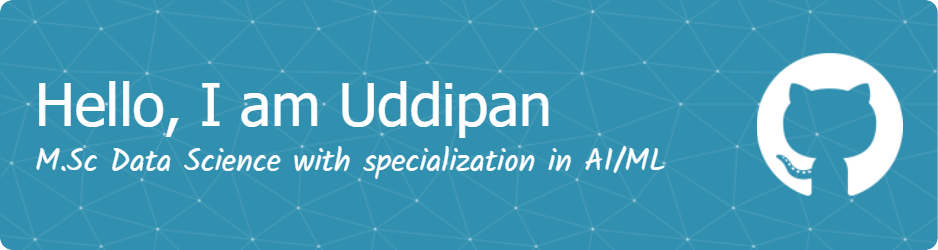
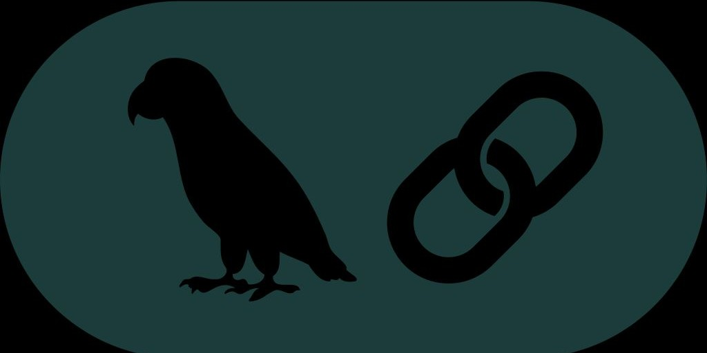

<h1 align="center">Hello there 👋, I'm Uddipan Basu Bir</h1>
<h3 align="center">A data science & AI enthusiast with the motivation of deriving meaningful interpretation from complex datasets.</h3>

 

  

 
   

- 🌱 I’m currently studying M.Sc. Data Science (Major in ML/AI) at [Friedrich-Alexander-Universität Erlangen-Nürnberg](https://www.fau.de)

- 🔭 I’m currently working as a Student Data Scientist at [Schaeffler](https://www.schaeffler.de/de/)

- 👨‍💻 All of my projects are available at [https://github.com/uddipan77?tab=repositories](https://github.com/uddipan77?tab=repositories)

- 📫 How to reach me **uddipanbb95@gmail.com**

- ⚡ Fun fact: I love to play football, chess and go for hiking.

<h3 align="left">Languages and Tools:</h3>

 

  
  
  <a href="https://github.com/ggerganov/llama.cpp" target="_blank" rel="noreferrer">
    
  </a>
</a>         <a href="https://www.tensorflow.org" target="_blank" rel="noreferrer">  </a> 

  

  

  

